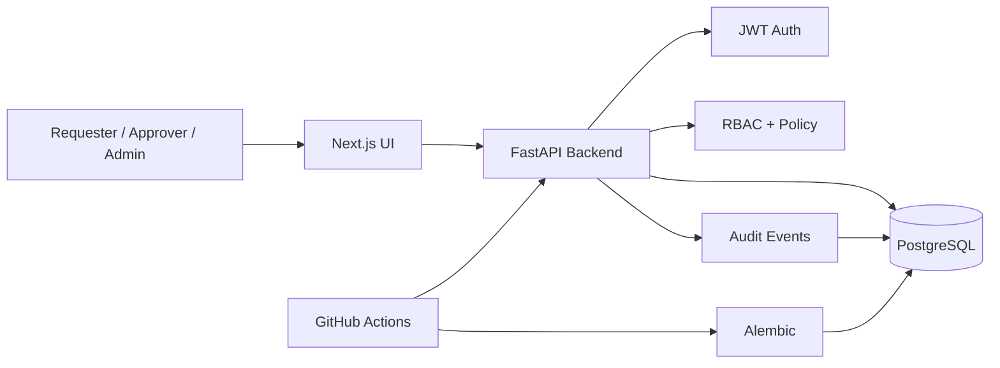
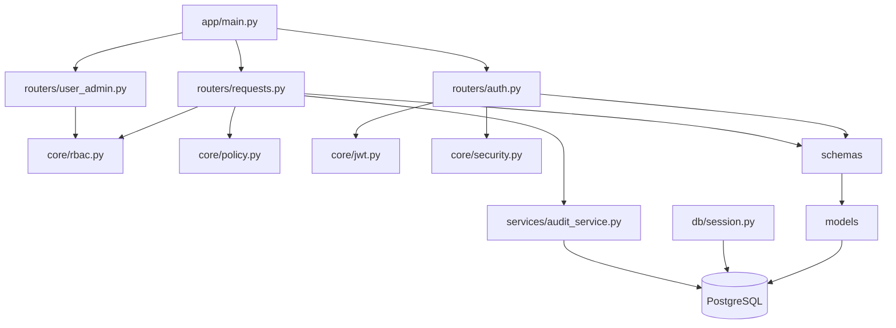
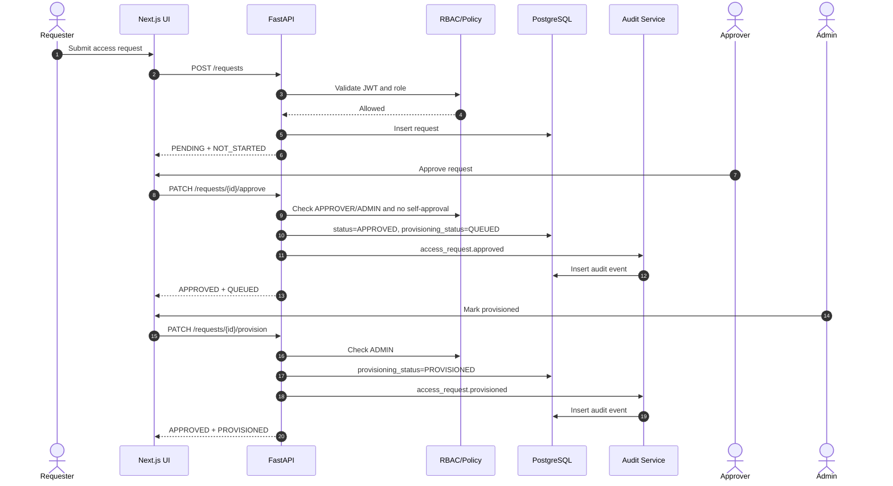
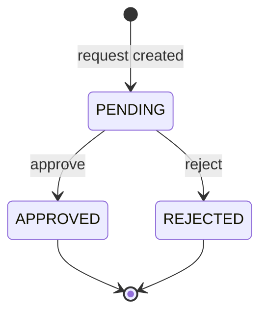
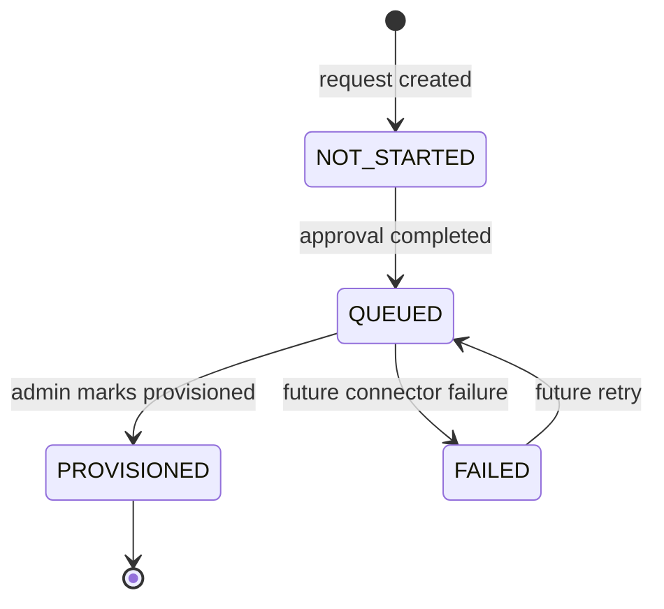
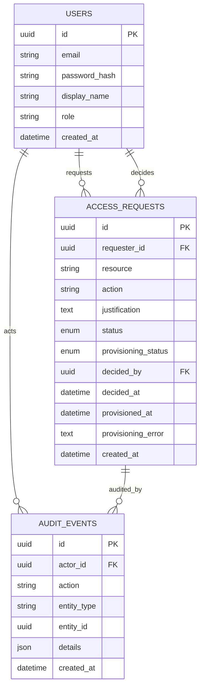
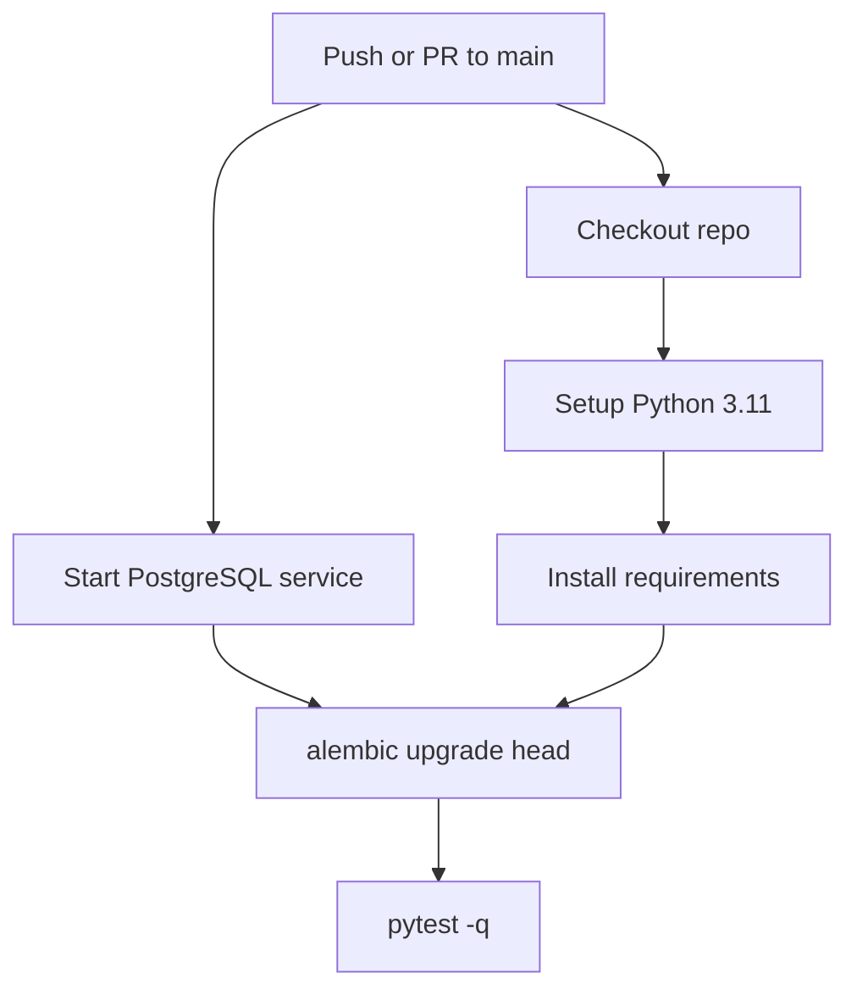

# AccessOps Architecture

AccessOps is an IAM/IGA-inspired access governance platform. The current implementation covers secure registration, JWT authentication, server-side RBAC, access request approval, provisioning lifecycle tracking, audit logging, backend CI, and a basic Next.js UI.

## Architecture Goals

| Goal | Implementation |
|---|---|
| Secure registration | Public registration creates only `REQUESTER`; browser-supplied role is rejected. |
| Server-side authorization | Backend RBAC dependencies enforce roles; UI is never authority. |
| Access request workflow | Requester creates; approver/admin approves or rejects. |
| Provisioning lifecycle | Approval and provisioning are separate lifecycle states. |
| Auditability | Approval, rejection, and provisioning emit audit events. |
| Migration discipline | Alembic owns database schema changes. |
| CI validation | GitHub Actions runs Postgres, Alembic, and pytest. |

## High-Level Design

## Backend Low-Level Design

## Modules

| Module | Purpose |
|---|---|
| `app/main.py` | FastAPI app, CORS, router registration, health check. |
| `app/routers/auth.py` | Register/login; registration assigns `REQUESTER` server-side. |
| `app/routers/requests.py` | Create/list/pending/approve/reject/provision request APIs. |
| `app/routers/user_admin.py` | Protected role-management endpoint. |
| `app/core/rbac.py` | JWT extraction and role guards. |
| `app/core/policy.py` | Business checks such as self-approval prevention. |
| `app/models` | SQLAlchemy persistence model. |
| `app/schemas` | Pydantic request/response contracts. |
| `app/services/audit_service.py` | Audit event persistence. |
| `alembic/versions` | Schema migrations. |
| `accessops-ui` | Next.js UI. |
| `.github/workflows/backend-ci.yml` | Backend CI workflow. |

## Runtime Request Flow

## Approval Lifecycle

## Provisioning Lifecycle

## Entity Relationship Model

## Entity Table

| Entity | Purpose | Key Fields |
|---|---|---|
| `User` | Authenticated identity. | `email`, `password_hash`, `role`, `display_name`. |
| `AccessRequest` | Access governance request. | `requester_id`, `resource`, `action`, `status`, `provisioning_status`. |
| `AuditEvent` | Governance event trail. | `actor_id`, `action`, `entity_type`, `entity_id`, `details`. |

## API Table

| Method | Path | Role | Purpose |
|---|---|---|---|
| `POST` | `/auth/register` | Public | Register requester account. |
| `POST` | `/auth/login` | Public | Return bearer token. |
| `POST` | `/requests` | Authenticated | Create request. |
| `GET` | `/requests` | Authenticated | List own/all requests based on role. |
| `GET` | `/requests/pending` | `APPROVER`, `ADMIN` | View pending approval queue. |
| `PATCH` | `/requests/{id}/approve` | `APPROVER`, `ADMIN` | Approve and queue provisioning. |
| `PATCH` | `/requests/{id}/reject` | `APPROVER`, `ADMIN` | Reject request. |
| `PATCH` | `/requests/{id}/provision` | `ADMIN` | Mark approved request as provisioned. |
| `PATCH` | `/user-admin/users/{user_id}/role` | `ADMIN` | Update user role. |
| `GET` | `/health` | Public | Health check. |

## Lifecycle Matrix

| Approval Status | Provisioning Status | Meaning |
|---|---|---|
| `PENDING` | `NOT_STARTED` | Waiting for approval decision. |
| `APPROVED` | `QUEUED` | Approved, but target access is not confirmed. |
| `APPROVED` | `PROVISIONED` | Approved and marked provisioned. |
| `APPROVED` | `FAILED` | Approved but provisioning failed. |
| `REJECTED` | `NOT_STARTED` | Denied; no provisioning expected. |

## CI Flow

## Local Run Strategy

Use `scripts/run_all.sh` to run backend validation locally. It installs dependencies, runs migrations, and executes tests. Use `--serve` to also start the backend and UI development servers.
